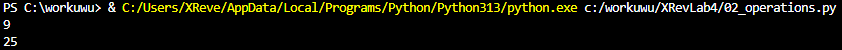

# Лабораторная работа №4
## Задание
1. Скачайть архив и распаковать его в свой репозиторий. В нём 11 заданий, которые нужно выполнить.
2. Оформить отчёт в README.md. По каждому из заданий - описание задачи, скриншот работы программы.
---
## Описание проделанной работы
### Задача №1
цель:
1. Составить словарь словарей расстояний между городами.

Для запуска, исполните файл `00_distance.py`.

---
### Задача №2
цель: 
1. Выведите на консоль значение прощади круга с точностю до 4-х знаков после запятой.
2. Если точка point лежит внутри круга то выведите на консоль True, Или False, если точка лежит вовне круга.
3. Аналогично для другой точки.

Для запуска, исполните файл `01_circle.py`.

---
### Задача №3
цель: 
1. Расставьте знаки операций "плюс", "минус", "умножение" и скобки
между числами "1 2 3 4 5" так, что бы получилось число "25".
2. Написать формулу для 1 2 3 4 5 и вывести значение на консоль.

Для запуска, исполните файл `02_operations.py`.

---
### Задача №4
цель: 
1. Выведите на консоль с помощью индексации строки, последовательно: первый фильм, последний, второй, второй с конца

Для запуска, исполните файл `03_favorite_movies.py`.

---
### Задача №5
цель: 
1. Создать списки
2. Вывести на консоль рост отца
3. Вывести на консоль общий рост вашей семьи как сумму ростов всех членов

Для запуска, исполните файл `04_my_family`.

---
### Задача №6
цель: 
1. Посадить медведя (bear) между львом и кенгуру.
2. Добавьте птиц из списка birds в последние клетки зоопарка.
3. Убрать слона.
4. Вывести на консоль в какой клетке сидит лев (lion) и жаворонок (lark).

Для запуска, исполните файл `05_zoo.py`.

---
### Задача №7
цель: 
1. Распечатайте общее время звучания трех песен: 'Halo', 'Enjoy the Silence' и 'Clean'.
2. Распечатайте общее время звучания трех песен: 'Sweetest Perfection', 'Policy of Truth' и 'Blue Dress'.

Для запуска, исполните файл `06_songs_list.py`.

---
### Задача №8
цель: 
1. Нужно расшифровать сообщение и вывести на консоль в удобочитаемом виде.

Для запуска, исполните файл `07_secret.py`.

---
### Задача №9
цель: 
1. Создать множество цветов, произрастающих в саду и на лугу.
2. Вывести на консоль все виды цветов.
3. Вывести на консоль те, которые растут и там и там.
4. Вывести на консоль те, которые растут в саду, но не растут на лугу.
5. Вывести на консоль те, которые растут на лугу, но не растут в саду.

Для запуска, исполните файл `08_garden.py`.

---
### Задача №10
цель: 
1. Создать словарь цен на продкты следующего вида (писать прямо в коде).
2. Указать надо только по 2 магазина с минимальными ценами.

Для запуска, исполните файл `09_shopping.py`.

---
### Задача №11
цель: 
1. Вывести стоимость каждого вида товара на складе

Для запуска, исполните файл `10_store.py`.
